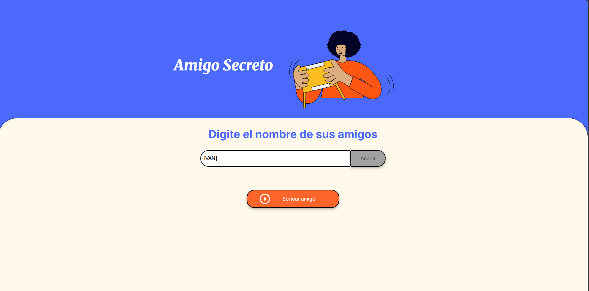
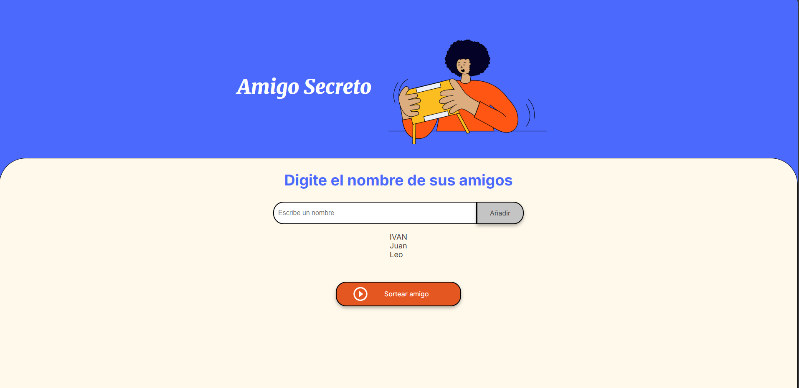
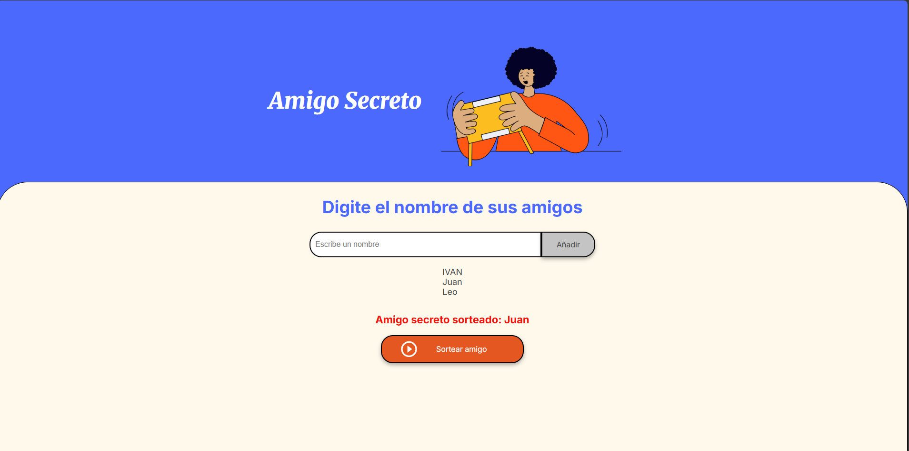
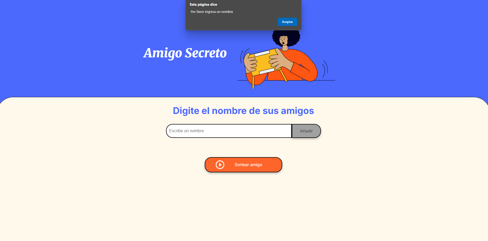
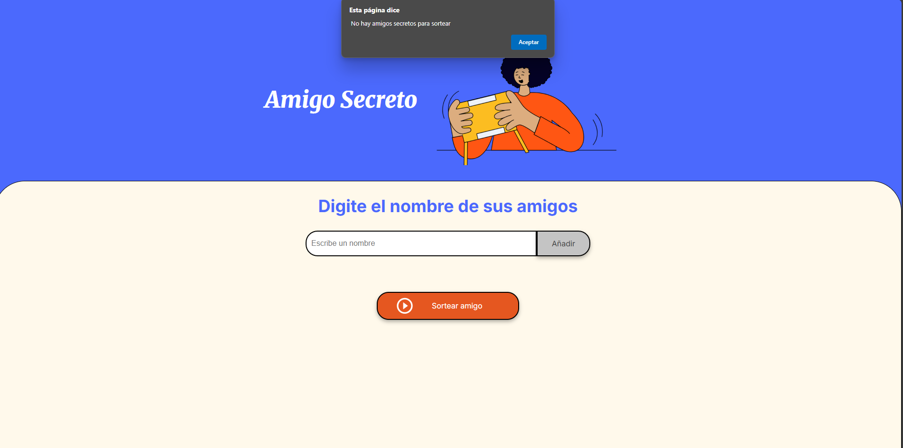

# Juego del Amigo Secreto — Challenge Alura Latam 


> **Nivel:** Principiante · **Stack:** HTML + CSS + JavaScript · **Estado:**  Funcional

> Este repositorio contiene mi solución al *challenge* de **Amigo Secreto** del curso **Alura Latam**. El objetivo es permitir que una persona agregue nombres a una lista y, con un botón, se sortee aleatoriamente un **amigo secreto**
---

#  Tabla de contenidos

* [Demo / Capturas](#-demo--capturas)
* [Objetivos de aprendizaje](#-objetivos-de-aprendizaje)
* [Instalación y ejecución](#-instalación-y-ejecución)
* [Dependencias](#-dependencias)
* [Guía visual ](#-guía-visual)
* [Cómo funciona ](#-cómo-funciona)
* [Problemas comunes y soluciones](#-problemas-comunes-y-soluciones)
* [Créditos](#-créditos)
---
# Demo / Capturas
* 🔗 **Demo en vivo:** [https://ivangamboa1.github.io/amigo-secreto/](https://ivangamboa1.github.io/amigo-secreto/)
---
##  Objetivos de aprendizaje
* Manipular el **DOM** (crear elementos, leer inputs, actualizar contenido con `innerHTML`).
* Usar **arrays** en JavaScript para almacenar datos en memoria.
* Aplicar **validaciones básicas** (no permitir nombres vacíos).
* Implementar un **sorteo aleatorio** con `Math.random()`.
* Separar responsabilidades con **HTML**, **CSS** y **JS**.
---
##  Instalación y ejecución
Opción A: Sin consola (descarga directa)
1. Haz clic en el botón verde **Code → Download ZIP** y descomprime.
2. Abre `index.html` en tu navegador.

### Opción B: Clonar con Git (opcional)
```bash
git clone https://github.com/IvanGamboa1/amigo-secreto.git
cd amigo-secreto
```
---
# Dependencias ]
> Este proyecto no requiere dependencias externas. Solo necesitas un navegador web moderno (Chrome, Firefox, Edge, etc.)
---
# Guia visual
# Pantalla inicial / Agregar primer nombre
 > En esta pantalla se escribe el nombre en el campo de texto y se presiona Añadir. Ya añadido 


# Lista con varios participantes
> Tras añadir varios nombres, se muestran en la zona de lista. Esto confirma que el array interno está guardando los valores.


# Resultado del sorteo 
> Al pulsar Sortear amigo, el sistema elige un nombre al azar y lo muestra en rojo con mayor énfasis.


# Validación: intento de agregar vacío
> Si presionas Añadir con el campo vacío, aparece una alerta pidiendo ingresar un nombre. Evita datos inválidos.


# Validación: sortear sin participantes
> Si intentas sortear sin haber agregado nombres, se alerta que no hay amigos para sortear.


---
# Diagrama de flujo del programa

1. **Inicio**
   - El usuario abre la aplicación.
2. **Ingresar nombre**
   - Se escribe un nombre en el campo de texto.
   - El sistema valida que no esté vacío.
3. **Añadir a la lista**
   - El nombre válido se guarda en un arreglo.
   - Se muestra en la lista de participantes.
4. **Validaciones**
   - Si el campo está vacío → alerta “Por favor ingresa un nombre”.
   - Si no hay participantes → alerta “No hay amigos secretos para sortear”.
5. **Sortear amigo**
   - El sistema selecciona un nombre al azar.
   - Muestra el resultado en pantalla.
6. **Fin**

---
# Problemas comunes y soluciones 
* No aparecen estilos → Verifica la ruta de style.css en el <head>.
* El botón no hace nada → Revisa que <script src="app.js" defer></script> esté al final del body.
* Se agregan nombres vacíos → Validación con .trim().
* Sorteo sin participantes → Alerta correspondiente.
---
## Creditos 
> Challenge: Alura Latam.
> Autor: Ivan Gamboa.

